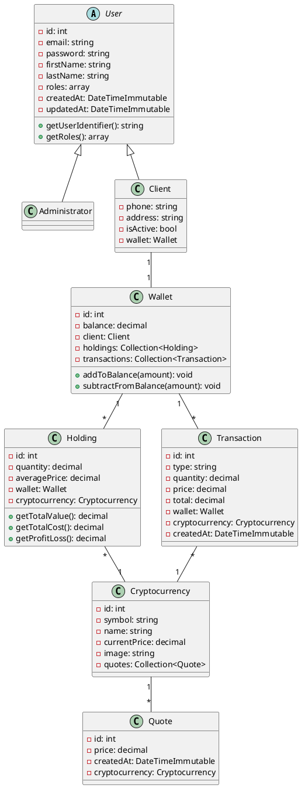

# BitChest - Dossier de Conception

## 1. Reformulation de la demande client

### Contexte

BitChest est une startup fondée par Martin, ancien trader passionné par les crypto-monnaies. L'objectif est de développer une plateforme d'achat et de vente de crypto-monnaies destinée à être commercialisée en marque blanche auprès d'entreprises financières.

### Objectifs du projet

- Développer un prototype fonctionnel de plateforme d'échange de crypto-monnaies
- Permettre aux particuliers d'acheter et vendre des crypto-monnaies
- Offrir une interface d'administration pour la gestion des clients
- Fournir une application responsive (mobile, tablette, desktop)

### Utilisateurs cibles

1. **Administrateurs** : Agents BitChest gérant la plateforme
2. **Clients** : Particuliers souhaitant investir dans les crypto-monnaies

---

## 2. Adresse GitHub

**Repository** : [À compléter avec votre URL GitHub]

---

## 3. Documents de conception de l'interface

### 3.1 Zoning

```
┌─────────────────────────────────────────────────────────────┐
│                         HEADER                               │
│  [Logo BitChest]                    [Navigation] [User Menu] │
├─────────────────────────────────────────────────────────────┤
│                                                              │
│  ┌─────────────┐  ┌──────────────────────────────────────┐  │
│  │             │  │                                      │  │
│  │   SIDEBAR   │  │            MAIN CONTENT              │  │
│  │             │  │                                      │  │
│  │  - Dashboard│  │   Dashboard / Wallet / Cryptos       │  │
│  │  - Wallet   │  │                                      │  │
│  │  - Cryptos  │  │                                      │  │
│  │  - Profile  │  │                                      │  │
│  │             │  │                                      │  │
│  └─────────────┘  └──────────────────────────────────────┘  │
│                                                              │
├─────────────────────────────────────────────────────────────┤
│                         FOOTER                               │
└─────────────────────────────────────────────────────────────┘
```

### 3.2 Wireframes

#### Page de connexion

```
┌─────────────────────────────────────┐
│           BitChest Logo             │
│                                     │
│  ┌─────────────────────────────┐   │
│  │        Login Form           │   │
│  │                             │   │
│  │  Email: [______________]    │   │
│  │                             │   │
│  │  Password: [___________]    │   │
│  │                             │   │
│  │  [      Sign In       ]     │   │
│  │                             │   │
│  │  Don't have an account?     │   │
│  │  [Register here]            │   │
│  └─────────────────────────────┘   │
└─────────────────────────────────────┘
```

#### Dashboard Client

```
┌─────────────────────────────────────────────────────────────┐
│  Balance: €XXX.XX                         [User] [Logout]   │
├─────────────────────────────────────────────────────────────┤
│                                                              │
│  ┌──────────────┐ ┌──────────────┐ ┌──────────────┐        │
│  │ Total Value  │ │ Profit/Loss  │ │  Net Worth   │        │
│  │   €XXXX.XX   │ │   +€XXX.XX   │ │  €XXXXX.XX   │        │
│  └──────────────┘ └──────────────┘ └──────────────┘        │
│                                                              │
│  Portfolio Holdings                                          │
│  ┌─────────────────────────────────────────────────────┐   │
│  │ Crypto │ Quantity │ Avg Price │ Value │ P/L        │   │
│  │ BTC    │ 0.5      │ €35000    │ €XXX  │ +XX%       │   │
│  │ ETH    │ 2.0      │ €2000     │ €XXX  │ -XX%       │   │
│  └─────────────────────────────────────────────────────┘   │
└─────────────────────────────────────────────────────────────┘
```

### 3.3 Maquette Figma

**Lien Figma** : [À compléter avec votre lien Figma public]

### 3.4 Schéma d'enchaînement des écrans

```
                    ┌─────────────┐
                    │   Login     │
                    └──────┬──────┘
                           │
           ┌───────────────┴───────────────┐
           │                               │
           ▼                               ▼
    ┌─────────────┐                 ┌─────────────┐
    │   Admin     │                 │   Client    │
    │  Dashboard  │                 │  Dashboard  │
    └──────┬──────┘                 └──────┬──────┘
           │                               │
     ┌─────┴─────┐               ┌─────────┼─────────┐
     │           │               │         │         │
     ▼           ▼               ▼         ▼         ▼
┌─────────┐ ┌─────────┐    ┌─────────┐ ┌───────┐ ┌───────┐
│ Clients │ │ Cryptos │    │ Wallet  │ │Cryptos│ │Profile│
│  CRUD   │ │  List   │    │         │ │       │ │       │
└────┬────┘ └─────────┘    └────┬────┘ └───┬───┘ └───────┘
     │                          │          │
     ▼                          │          ▼
┌─────────┐                     │    ┌───────────┐
│ Client  │                     │    │  Crypto   │
│ Details │                     │    │  Detail   │
└─────────┘                     │    │  + Chart  │
                                │    └─────┬─────┘
                                │          │
                                ▼          ▼
                          ┌──────────────────────┐
                          │   Buy / Sell Crypto  │
                          └──────────────────────┘
```

---

## 4. Liste Fonctionnelle

### 4.1 Fonctionnalités Administrateur

| ID  | Fonctionnalité      | Description                                            | Priorité |
| --- | ------------------- | ------------------------------------------------------ | -------- |
| A01 | Authentification    | Connexion sécurisée avec email/mot de passe            | Haute    |
| A02 | Tableau de bord     | Vue d'ensemble des statistiques                        | Haute    |
| A03 | Gestion profil      | Modifier ses données personnelles                      | Moyenne  |
| A04 | Liste clients       | Afficher tous les clients                              | Haute    |
| A05 | Créer client        | Ajouter un nouveau client avec mot de passe temporaire | Haute    |
| A06 | Modifier client     | Éditer les informations d'un client                    | Haute    |
| A07 | Supprimer client    | Supprimer un client                                    | Haute    |
| A08 | Activer/Désactiver  | Changer le statut d'un client                          | Moyenne  |
| A09 | Voir détails client | Consulter le portefeuille d'un client                  | Moyenne  |
| A10 | Liste cryptos       | Afficher toutes les crypto-monnaies et cours           | Haute    |

### 4.2 Fonctionnalités Client

| ID  | Fonctionnalité    | Description                             | Priorité |
| --- | ----------------- | --------------------------------------- | -------- |
| C01 | Inscription       | Créer un compte avec email/mot de passe | Haute    |
| C02 | Authentification  | Connexion sécurisée                     | Haute    |
| C03 | Tableau de bord   | Vue portefeuille et statistiques        | Haute    |
| C04 | Gestion profil    | Modifier ses données personnelles       | Moyenne  |
| C05 | Voir portefeuille | Afficher holdings et transactions       | Haute    |
| C06 | Liste cryptos     | Voir toutes les cryptos disponibles     | Haute    |
| C07 | Détail crypto     | Voir prix et graphique d'évolution      | Haute    |
| C08 | Acheter crypto    | Acheter une quantité au cours actuel    | Haute    |
| C09 | Vendre crypto     | Vendre ses cryptos et récupérer EUR     | Haute    |
| C10 | Historique        | Voir l'historique des transactions      | Moyenne  |

---

## 5. Schémas de la Base de Données

### 5.1 Modèle Conceptuel de Données (MCD)

```
┌─────────────────┐         ┌─────────────────┐
│      USER       │         │ CRYPTOCURRENCY  │
├─────────────────┤         ├─────────────────┤
│ id (PK)         │         │ id (PK)         │
│ email           │         │ symbol          │
│ password        │         │ name            │
│ firstName       │         │ currentPrice    │
│ lastName        │         │ image           │
│ roles           │         │ createdAt       │
│ createdAt       │         └────────┬────────┘
│ updatedAt       │                  │
│ discr           │                  │ 1,n
└────────┬────────┘                  │
         │                   ┌───────┴───────┐
    ┌────┴────┐              │     QUOTE     │
    │         │              ├───────────────┤
┌───┴───┐ ┌───┴───┐          │ id (PK)       │
│ ADMIN │ │CLIENT │          │ price         │
└───────┘ └───┬───┘          │ createdAt     │
              │              │ crypto_id(FK) │
              │ 1,1          └───────────────┘
              │
        ┌─────┴─────┐
        │  WALLET   │
        ├───────────┤
        │ id (PK)   │
        │ balance   │
        │ client_id │
        │ createdAt │
        └─────┬─────┘
              │ 1,n
      ┌───────┴───────┐
      │               │
┌─────┴─────┐  ┌──────┴──────┐
│  HOLDING  │  │ TRANSACTION │
├───────────┤  ├─────────────┤
│ id (PK)   │  │ id (PK)     │
│ quantity  │  │ type        │
│ avgPrice  │  │ quantity    │
│ wallet_id │  │ price       │
│ crypto_id │  │ total       │
└───────────┘  │ wallet_id   │
               │ crypto_id   │
               │ createdAt   │
               └─────────────┘
```

### 5.2 Diagramme de classes UML



---

## 6. Architecture Technique

### 6.1 Stack Technologique

| Couche               | Technologie      | Version |
| -------------------- | ---------------- | ------- |
| **Backend**          | PHP              | 8.2+    |
| **Framework**        | Symfony          | 7.x     |
| **Base de données**  | MySQL            | 8.0     |
| **ORM**              | Doctrine         | 3.x     |
| **Frontend**         | Twig + Bootstrap | 5.3     |
| **Graphiques**       | Chart.js         | 4.x     |
| **Authentification** | Symfony Security | 7.x     |

### 6.2 Architecture Multicouche

```
┌─────────────────────────────────────────────────────────────┐
│                    COUCHE PRÉSENTATION                       │
│  ┌─────────────────────────────────────────────────────┐    │
│  │  Templates Twig + Bootstrap 5 + Chart.js            │    │
│  │  - Responsive Design (Mobile/Tablet/Desktop)        │    │
│  │  - CSRF Protection                                  │    │
│  └─────────────────────────────────────────────────────┘    │
├─────────────────────────────────────────────────────────────┤
│                    COUCHE CONTRÔLEUR                         │
│  ┌─────────────────────────────────────────────────────┐    │
│  │  Controllers Symfony                                 │    │
│  │  - SecurityController (Auth)                        │    │
│  │  - AdminDashboardController                         │    │
│  │  - ClientManagementController                       │    │
│  │  - ClientDashboardController                        │    │
│  │  - WalletController                                 │    │
│  │  - TransactionController                            │    │
│  └─────────────────────────────────────────────────────┘    │
├─────────────────────────────────────────────────────────────┤
│                    COUCHE MÉTIER (Services)                  │
│  ┌─────────────────────────────────────────────────────┐    │
│  │  - CalculationService (calculs portefeuille)        │    │
│  │  - TransactionService (achat/vente)                 │    │
│  │  - WalletService (gestion solde)                    │    │
│  │  - QuoteGeneratorService (cotations)                │    │
│  │  - CryptocurrencyService (données crypto)           │    │
│  └─────────────────────────────────────────────────────┘    │
├─────────────────────────────────────────────────────────────┤
│                    COUCHE SÉCURITÉ                           │
│  ┌─────────────────────────────────────────────────────┐    │
│  │  - LoginFormAuthenticator                           │    │
│  │  - Voters (ClientVoter, TransactionVoter)           │    │
│  │  - Password Hasher                                  │    │
│  │  - CSRF Token Manager                               │    │
│  └─────────────────────────────────────────────────────┘    │
├─────────────────────────────────────────────────────────────┤
│                    COUCHE DONNÉES                            │
│  ┌─────────────────────────────────────────────────────┐    │
│  │  Doctrine ORM + Repositories                        │    │
│  │  - UserRepository                                   │    │
│  │  - ClientRepository                                 │    │
│  │  - WalletRepository                                 │    │
│  │  - CryptocurrencyRepository                         │    │
│  │  - TransactionRepository                            │    │
│  └─────────────────────────────────────────────────────┘    │
├─────────────────────────────────────────────────────────────┤
│                    BASE DE DONNÉES                           │
│  ┌─────────────────────────────────────────────────────┐    │
│  │                    MySQL 8.0                        │    │
│  └─────────────────────────────────────────────────────┘    │
└─────────────────────────────────────────────────────────────┘
```

---

## 7. Besoins d'éco-conception

### 7.1 Optimisations Frontend

- Minification CSS/JS en production
- Lazy loading des images
- Cache navigateur pour assets statiques

### 7.2 Optimisations Backend

- Cache Symfony pour les requêtes fréquentes
- Pagination des listes (éviter chargement massif)
- Requêtes Doctrine optimisées (lazy loading)

### 7.3 Base de données

- Index sur les colonnes fréquemment requêtées
- Nettoyage périodique des anciennes cotations

---

## 8. Stratégie de Sécurité

### 8.1 Sécurité Frontend

| Risque       | Protection              | Implémentation         |
| ------------ | ----------------------- | ---------------------- |
| XSS          | Échappement automatique | Twig auto-escape       |
| CSRF         | Tokens de validation    | Symfony CSRF Component |
| Clickjacking | Headers HTTP            | X-Frame-Options        |

### 8.2 Sécurité Backend

| Risque           | Protection         | Implémentation     |
| ---------------- | ------------------ | ------------------ |
| Injection SQL    | Requêtes préparées | Doctrine ORM       |
| Authentification | Hashage sécurisé   | bcrypt/argon2      |
| Autorisation     | Contrôle d'accès   | Voters + IsGranted |
| Session          | Gestion sécurisée  | Symfony Security   |

### 8.3 Sécurité Base de Données

| Risque             | Protection            | Implémentation            |
| ------------------ | --------------------- | ------------------------- |
| Accès non autorisé | Credentials sécurisés | Variables d'environnement |
| Injection          | ORM uniquement        | Pas de SQL brut           |
| Données sensibles  | Hashage mots de passe | UserPasswordHasher        |

### 8.4 Bonnes Pratiques Appliquées

1. **Principe du moindre privilège** : Chaque utilisateur n'a accès qu'aux ressources nécessaires
2. **Validation des entrées** : Tous les formulaires sont validés côté serveur
3. **Gestion des erreurs** : Messages d'erreur génériques (pas de fuite d'information)
4. **HTTPS** : Chiffrement des communications (à configurer en production)
5. **Mots de passe** :
    - Hashage avec algorithme moderne (bcrypt)
    - Mots de passe temporaires générés aléatoirement
    - Pas de stockage en clair

---

## 9. Captures d'écran

[À compléter avec les screenshots de l'application]

- Page de connexion
- Dashboard Admin
- Liste des clients
- Création client
- Dashboard Client
- Portefeuille
- Liste des cryptos
- Détail crypto avec graphique
- Achat/Vente

---

## 10. Déploiement

Voir le document séparé : `deploiement/guide-deploiement.md`
